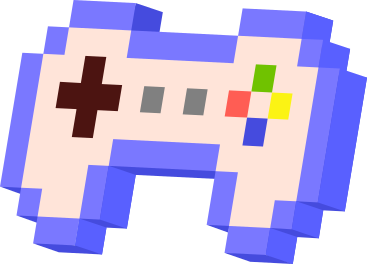

 

 

# chat_github_robot

本项目希望开发一个github仓库对话机器人。用户通过输入仓库对应URL后，机器人能够回答关于仓库的相关信息，帮助用户学习使用相应仓库。在系统设计上采用了**springboot** + **Flask**的混合框架。同时基于**matrix one**完成了向量存储 && 检索以构建本地知识库。

### Why matrix one?

MatrixOne的HSTAP数据库技术与Dell ObjectScale的可扩展对象存储相结合，为AI生成内容（AIGC）提供了强大的平台。该解决方案的高性能和可扩展性使组织能够快速高效地训练和部署人工智能模型，从而加速有价值的见解和内容的生成。

### Why springboot ?

:one: 开发人员生产力的大幅提升

:two: 简化的高级抽象

:three: 微服务和云原生友好

## 前端
采用VUE编写，代码参考了 [https://github.com/seisgo/EllipseFit](https://gitee.com/mao-yongyao/chatroom)在此表示感谢！

## 后端
💥 技术栈 **springboot**, **mybatis plus**, **matrix one**, **spring security**, **redis**, **mysql**, **flask**  

  <code></code><code></code>  <code></code>

### 🧃 相关问题及解决方案

## milestone
### 2-20
  集成swagger到springboot中，方便接口文档配置  
  修改了仓库存储逻辑，分为了仓库表和用户对应仓库两张表
### 2-21
  完成了HTTP Client的实现及测试
### 2-23
  将python backend 修改成了使用文心一言接口，来解决chatgpt key无法使用问题。 
  录制了问答my_malloc的demo视频
### 2-25
  对对话存储进行了优化，采用redis进行缓存，并使用spring scheduler进行定时更新。 

## 贡献规则
参考contributing.md
