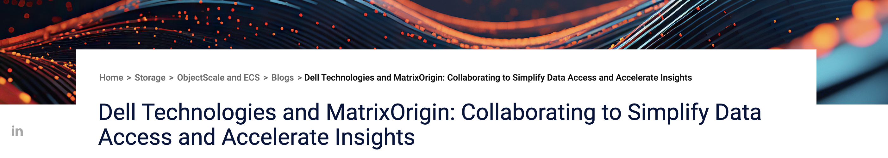

 

   
 

# github仓库对话机器人 - 小伯

本项目希望开发一个github仓库对话机器人。用户通过输入仓库对应URL后，机器人能够回答关于仓库的相关信息，帮助用户学习使用相应仓库。在系统设计上采用了**springboot** + **Flask**的混合框架。同时基于**matrix one**完成了向量存储 && 检索以构建本地知识库。

### Why matrix one?

MatrixOne的HSTAP数据库技术与Dell ObjectScale的可扩展对象存储相结合，为AI生成内容（AIGC）提供了强大的平台。该解决方案的高性能和可扩展性使组织能够快速高效地训练和部署人工智能模型，从而加速有价值的见解和内容的生成。

### Why springboot ?

:one: 开发人员生产力的大幅提升

:two: 简化的高级抽象

:three: 微服务和云原生友好

## 💪  功能介绍

### 💬 对话

支持多轮对话，帮助您持续学习。
能够选择不同的仓库进行问答。
**开发中​ ** ​ :briefcase:  通过 System Prompt的介入，使得bot能更精确的了解到您的需求。
**开发中 **  支持多人对话，帮助您进行多人协同工作。

### :card_file_box: 仓库管理

**一键上传** 支持一键上传仓库，让gpt帮你完成量子速度:fire:。
**超细颗粒度更新** 支持根据不同版本的commit进行更新，帮助您从头开始了解项目。

### 📜 对话历史

对话历史自动保存，一键查看。
用户间对话记录📝相互隔离，最大程度保护您的隐私🔏。

## 前端
采用VUE编写，代码参考了 [https://github.com/seisgo/EllipseFit](https://gitee.com/mao-yongyao/chatroom)在此表示感谢！

## 后端
💥 技术栈 **springboot**, **mybatis plus**, **matrix one**, **spring security**, **redis**, **mysql**, **flask**  

  <code></code><code></code>  <code></code>

### 🧃 相关问题及解决方案

#### 分布式事务的最终一致性问题

**Springboot**中对应的是用户下载仓库表，而**Flask**中为对应的文本向量表。必须保证两张表的最终一致性 ,以确保系统的正确运行。本项目采用rocketMq:rocket:进行解决。

## 贡献规则
参考contributing.md
